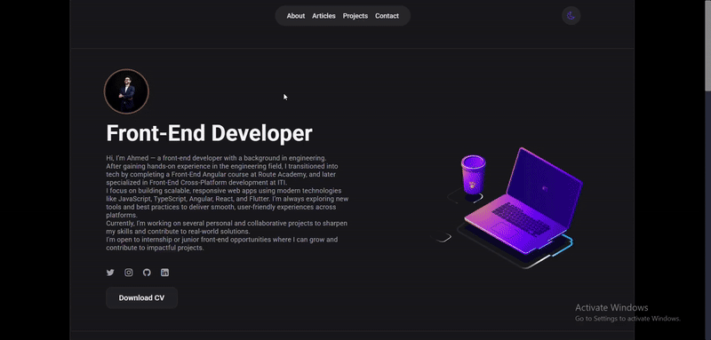
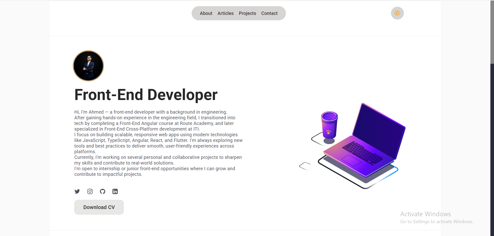
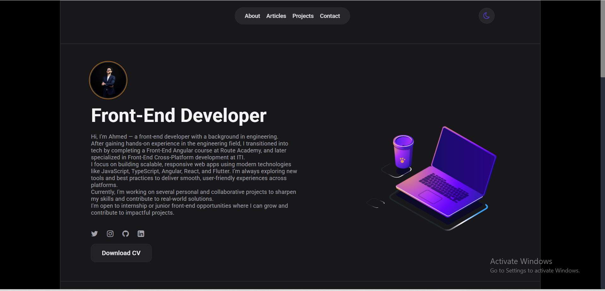
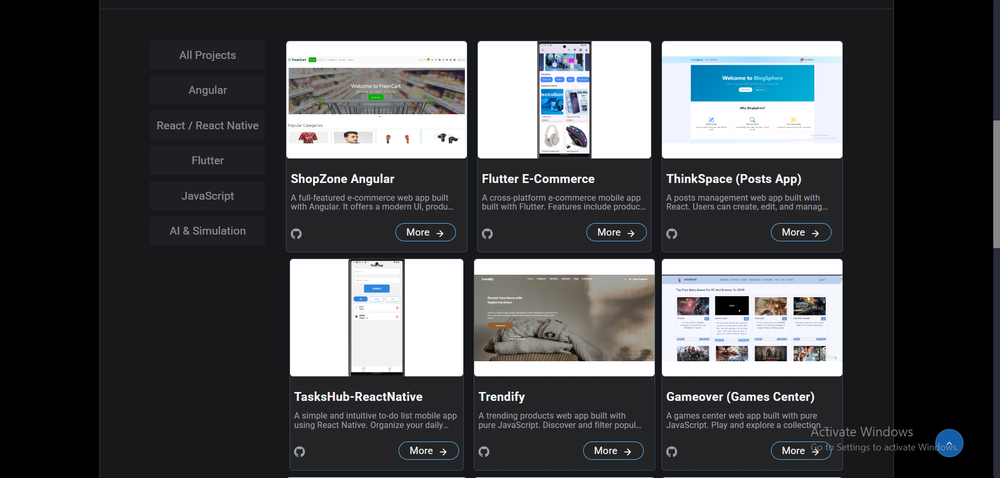
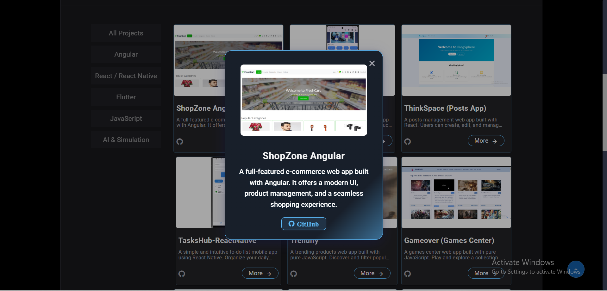
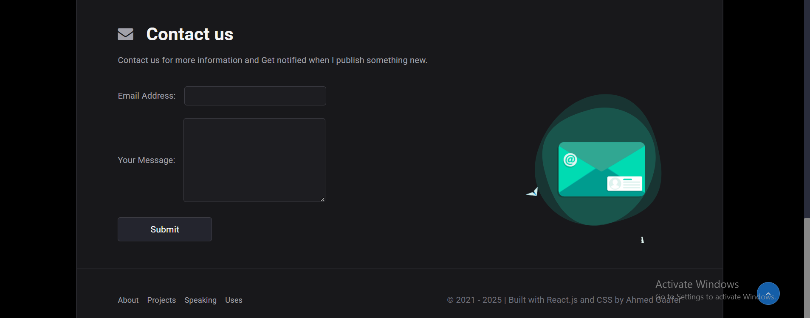

# 👋 Ahmed Gaafer — Front-End Developer Portfolio

Welcome! I'm Ahmed Gaafer, a passionate Front-End Developer with an engineering background. I specialize in building responsive, scalable web and mobile applications using modern tools like Angular, React, Flutter, and TypeScript.

---

## 🚀 Quick Preview

<table>
  <tr>
    <td></td>
    <td></td>
  </tr>
  <tr>
    <td></td>
    <td></td>
  </tr>
  <tr>
    <td colspan="2" align="center"></td>
  </tr>
</table>

---

## 📌 Table of Contents

- [About Me](#about-me)
- [Technologies](#technologies)
- [Projects](#projects)
  - [Angular](#angular)
  - [Flutter](#flutter)
  - [React / React Native](#react--react-native)
  - [JavaScript](#javascript)
  - [AI & Simulation](#ai--simulation)
  - [Portfolio](#portfolio)
- [Contact](#contact)
- [Download CV](#download-cv)
- [License](#license)

---

## 👨‍💻 About Me

I'm a front-end developer with a civil engineering background. After gaining hands-on experience in the engineering field, I transitioned into tech through the Front-End Angular program at Route Academy and the Cross-Platform Development track at ITI.

I focus on building elegant, efficient UIs and delivering smooth digital experiences across platforms. I’m currently working on real-world projects to sharpen my skills and explore new technologies. I'm open to internship or junior roles where I can grow and contribute to impactful solutions.

---

## 🛠️ Technologies

- **Languages**: JavaScript, TypeScript, HTML, CSS
- **Frameworks**: Angular, React, Flutter, React Native
- **Libraries**: Lottie, Framer Motion, Formspree
- **Tools**: Git, GitHub, VSCode, npm, Webpack
- **Design**: Figma, Adobe XD, Photoshop

---

## 💼 Projects

### 🔷 Angular

#### [ShopZone Angular](https://github.com/ahmedgaafer1/shopzone-angular) 

> A full-featured e-commerce web app built with Angular. It supports product browsing, cart functionality, dynamic routing, and a responsive design for seamless shopping.

---

### 🟣 Flutter

#### [E-commerce Flutter App](https://github.com/ahmedgaafer1/E-commerce-Flutter) 

> A cross-platform mobile app for online shopping. Built with Flutter and Dart, it includes product listings, cart management, and a sleek user interface.

---

### ⚛️ React / React Native

#### [ThinkSpace](https://github.com/ahmedgaafer1/ThinkSpace) 

> A post management platform built with React. Users can create, edit, and delete posts in a clean and responsive interface.

#### [TasksHub React Native](https://github.com/ahmedgaafer1/TasksHub-ReactNative) 

> A lightweight and intuitive to-do list mobile app. Designed for task organization with a focus on usability and cross-platform performance.

---

### 📜 JavaScript Projects

#### [Trendify](https://github.com/ahmedgaafer1/Trendify) 

> A trending product discovery platform using pure JavaScript. Users can browse and filter items with a fast, interactive UI.

#### [Gameover](https://github.com/ahmedgaafer1/gameover-proJect)

> A JS-based game center that brings together a collection of mini-games in a fun, responsive layout.

#### [Facebook-MUI](https://github.com/ahmedgaafer1/Facebook-MUI)

> A UI simulation of Facebook built with vanilla JS, HTML, and CSS. Includes layout, feed, and interactive components.

---

### 🤖 AI & Simulation

#### [GPT Prompt Box](https://github.com/ahmedgaafer1/gpt-prompt-box)

> A simulated Telegram-style UI built with JavaScript, enabling chat-based interaction with generative AI prompts.

---

### 🌐 Portfolio Website

#### [Portfolio](https://github.com/ahmedgaafer1/Portfolio)

> This very portfolio! Built with React to showcase my projects, tech stack, and contact details in a simple, clean layout.

---

## 📬 Contact

- **Email**: [ahmedmohammedgaafer@gmail.com](mailto:ahmedgaafer.dev@gmail.com)
- **LinkedIn**: [Ahmed Gaafer](https://www.linkedin.com/in/ahmedgaafer/)
- **GitHub**: [@ahmedgaafer1](https://github.com/ahmedgaafer1)

---

## 📄 Download CV

📎 [Click here to download my CV](https://drive.google.com/uc?export=download&id=10XvVKsrFRgA2aNddFBPs075mDmZEApPR)

---

## 📝 License

This project is licensed under the MIT License. See the [LICENSE](LICENSE) file for more information.

---

> ⚡ **Thanks for visiting!**  
> If you found my work interesting, feel free to reach out or ⭐ any repo. Let's build something amazing together!
